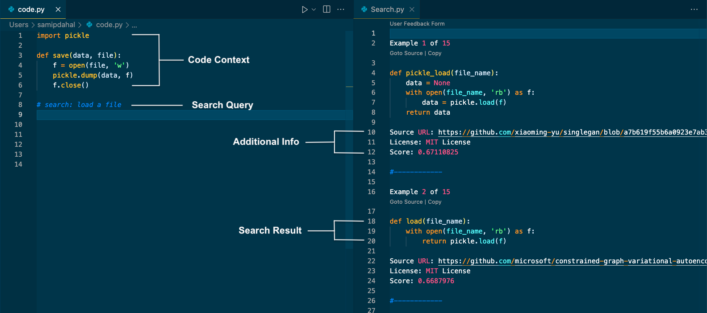

# Scotch: A Semantic Code Search Engine for IDEs 



## Introduction
We introduce Scotch, a semantic code search tool that runs within an IDE. The semantic nature of code search in Scotch allows us to leverage the semantic meaning of code via learned vector representations, while the in-IDE nature helps to improve developers' productivity by eliminating the need to navigate to web-browsers to search for code. Moreover, the query used for code search is oftentimes ambiguous without the surrounding context of the search. In direct contrast to traditional search engines tailored to take a single line of input, the in-IDE nature of Scotch allows it to automatically infer code context during search and utilize it for search results. Hence, we propose the task `contextual code search' and present an analysis of how this code context can help improve the relevance of search results. We collect and contribute a dataset of about 19M functions from GitHub repositories with permissive licenses, which is the first large-scale dataset openly available for the task of contextual code search. The dataset also contains 4M NL-Code pairs, openly available at Huggingface datasets: https://huggingface.co/datasets/Samip/Scotch. All of 19M pairs along with manual test set will be released soon.

For more details, read our paper: https://openreview.net/forum?id=rSxfCiOZk-c

## Code Navigation
### Model
Model training: scripts/train_base.sh for baseline model and scripts/train_context.sh for contextual code search model.

Evaluation: ```src/eval_base.sh``` for baseline model and ```src/eval_context.sh``` for contextual code search model.

Make ScaNN index: ```src/make_index.py```

Quick Prediction: ```src/predict_base.sh``` for baseline model and ```src/predict_context.sh``` for contextual code search model.

### Extension
Find the extension code in ```vscode_extension``` dir.


## Usage
On a comment line, type "search:" (capitalization and spacing do not matter) followed by your Query and press the return key.

## Examples
### Python:
\# search: YOUR_QUERY + return_key

### Java, Javascript, Go: 
// search: YOUR_QUERY + return_key

---
Cited as:
```
@inproceedings{
dahal2022scotch,
title={Scotch: A Semantic Code Search Engine for {IDE}s},
author={Samip Dahal and Adyasha Maharana and Mohit Bansal},
booktitle={Deep Learning for Code Workshop},
year={2022},
url={https://openreview.net/forum?id=rSxfCiOZk-c}
}
```